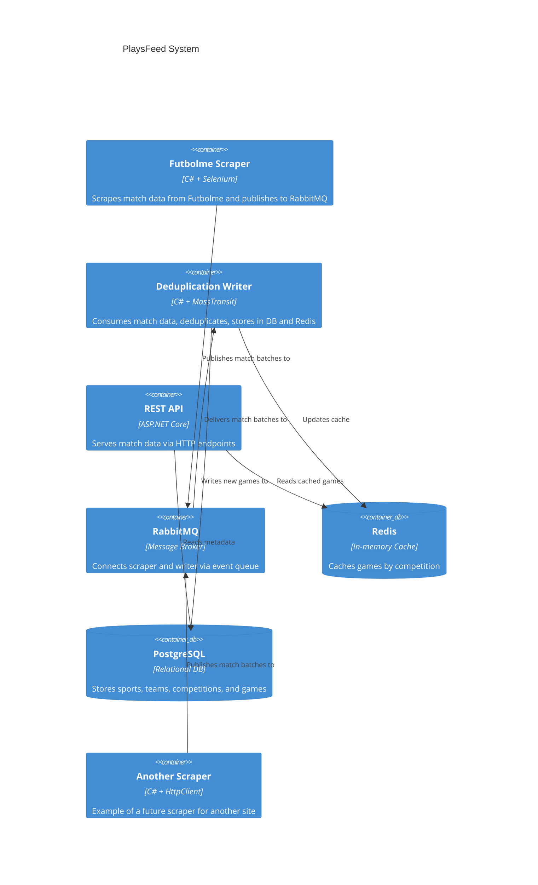
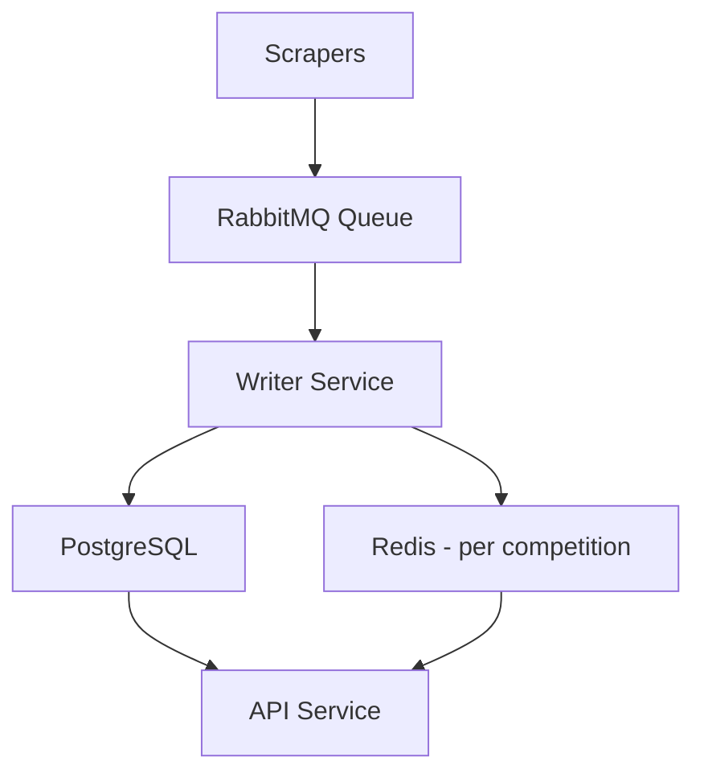

# PlaysFeed

## 1. Project Overview

**PlaysFeed** is a distributed system for collecting, deduplicating, storing, and exposing sports match data via a RESTful API.

It is designed to process match results from external websites (starting with (https://www.futbolme.com/), transform them into a normalized format, and make them available to client applications and services. The system ensures no duplicate games are stored by applying custom deduplication logic based on sport, competition, teams (order-insensitive), and a time window.

**Key goals:**
- Automatically fetch and scrape sports results.
- Detect and eliminate duplicate records before storage.
- Persist validated games in PostgreSQL.
- Cache games per competition in Redis for fast access.
- Provide HTTP API endpoints to access sports, competitions, teams, and games.

The system is built using:
- **.NET 8** microservices.
- **PostgreSQL** for persistent storage.
- **Redis** for fast, per-competition game access.
- **RabbitMQ** for communication between components.
- **MassTransit** for message handling and batching.

## 2. Architecture

PlaysFeed is structured as a set of independent services that communicate via RabbitMQ. Each service is responsible for a distinct concern in the data lifecycle—from scraping to persistence to API access.

### Microservices Overview

| Service | Description |
|--------|-------------|
| **PlaysFeed.Futbolme** | PlaysFeed.Futbolme – Scraper that extracts match results from external websites like Futbolme. The system is designed to support multiple scrapers. New scraper services can be added to target other data sources and publish match results to the same RabbitMQ queue. Uses Selenium for navigation and publishes match data via RabbitMQ. |
| **PlaysFeed.Writer** | Consumes batches of match results, deduplicates them, writes new entries to PostgreSQL, and updates Redis caches grouped by competition. The writer can be horizontally scaled by configuring separate instances to handle different sports or competitions. Each instance can filter and process specific messages based on routing keys or message headers in RabbitMQ. |
| **PlaysFeed.Api** | Exposes REST endpoints for accessing sports, competitions, teams, and games. This service is stateless and reads from PostgreSQL and Redis, which makes it highly scalable and suitable for horizontal scaling (running multiple instances behind a load balancer). It reads frequently requested data (e.g., games by competition) from Redis for low-latency responses, and falls back to PostgreSQL for more complex queries. PostgreSQL can be scaled using read replicas to handle query load distribution.|
| **PlaysFeed.DataAccess** | Shared library containing the database context and entity definitions for sports, teams, competitions, and games. |

---

### External Dependencies

| Dependency | Role |
|------------|------|
| **PostgreSQL** | Main relational database for storing games, teams, sports, and competitions. |
| **Redis** | Caches games per competition for fast API access. |
| **RabbitMQ** | Message broker used to pass match data between the scraper and the writer. |
| **MassTransit** | Messaging library used for batching and consumer orchestration. |

---

### C4 Model Diagram (Container level)




## 3. Features

PlaysFeed delivers a complete pipeline for collecting, processing, and exposing sports match data in a scalable way.

### Sports & Competitions

- Retrieve a list of supported sports.
- Fetch competitions grouped under each sport.
- Retrieve detailed information about competitions, including associated games.

### Teams

- List all teams participating in any sport.
- Associate teams with specific games and competitions.

### Games

- Scraped match results include:
  - Sport name
  - Competition name
  - Home and visiting teams
  - Match date and time
- Games are stored in PostgreSQL and grouped in Redis by competition ID for fast access.

### Deduplication

- Custom logic ensures that duplicate games are not saved:
  - Based on combination of sport, competition, home/visiting teams (order-insensitive), and a 2-hour window.
  - Only unique games are persisted.

### Scraping & Publishing

- Selenium-based web scraping from Futbolme.
- Extracted match results are published to RabbitMQ as batches.

### Writing Pipeline

- `DeduplicationWriter` service:
  - Consumes match batches from the message bus.
  - Deduplicates against existing data.
  - Saves new games to PostgreSQL.
  - Updates Redis cache by competition.

### API Access

- REST API serves:
  - `/sports`
  - `/competitions`
  - `/competitions/{id}` (games by competition)
  - `/teams`

## 4. Getting Started

This section helps you set up the PlaysFeed environment locally using Docker.

### Prerequisites

Before running the system, make sure you have:

- **Docker** and **Docker Compose** installed
- [.NET 8 SDK](https://dotnet.microsoft.com/en-us/download/dotnet/8.0)

### Quick Start (via Docker Compose)

1. Clone the repository:

   ```bash
   git clone https://github.com/your-org/playsfeed.git
   cd playsfeed
   ```

2. Start dependencies:

   ```bash
   docker-compose up -d
   ```

   This launches:
   - PostgreSQL on port **5460**
   - Redis on port **6380**
   - RabbitMQ (management UI at [http://localhost:15681](http://localhost:15681), default user: `guest`, pass: `guest`)

3. Run services:

   Open multiple terminals and run:

   - **PlaysFeed.Futbolme** (scraper):
     ```bash
     dotnet run --project src/PlaysFeed.Futbolme
     ```

   - **PlaysFeed.Writer** (consumer/writer):
     ```bash
     dotnet run --project src/PlaysFeed.Writer
     ```

   - **PlaysFeed.Api** (REST API):
     ```bash
     dotnet run --project src/PlaysFeed.Api
     ```

### Testing the API

Once the API is running, test endpoints like:

```http
GET http://localhost:5000/sports
GET http://localhost:5000/competitions
GET http://localhost:5000/competitions/{id}
GET http://localhost:5000/teams
```

## 5. API Usage

The PlaysFeed API provides access to the stored and cached match data. All endpoints return JSON responses.

### Base URL

```
http://localhost:5000
```

Adjust the port if you've configured the API differently.

### Endpoints

#### GET /sports

Returns a list of all available sports.

**Response:**
```json
[
  { "id": 1, "name": "Football" },
  { "id": 2, "name": "Basketball" }
]
```

---

#### GET /competitions

Returns a list of all competitions across sports.

**Response:**
```json
[
  { "id": 10, "name": "La Liga", "sport": "Football" },
  { "id": 20, "name": "NBA", "sport": "Basketball" }
]
```

---

#### GET /competitions/{id}

Returns the list of games for a specific competition. The response is read from Redis if available.

**Example:**
```
GET /competitions/10
```

**Response:**
```json
[
  {
    "sport": "Football",
    "competition": "La Liga",
    "homeTeam": "Barcelona",
    "visitingTeam": "Real Madrid",
    "date": "2025-03-28T20:00:00Z"
  }
]
```

---

#### GET /teams

Returns a list of all teams.

**Response:**
```json
[
  { "id": 100, "name": "Barcelona" },
  { "id": 101, "name": "Real Madrid" }
]
```

---

## 6. Data Flow

This section describes how match data moves through the PlaysFeed system, from scraping to API availability.

### Step-by-Step Flow

1. **Scraping (PlaysFeed.Futbolme)**
   - The scraper uses Selenium to navigate Futbolme and extract match results.
   - Scraped results include sport, competition, home team, visiting team, and match date.
   - Results are grouped into batches and published to RabbitMQ using MassTransit.

Multiple scraper services can be deployed in parallel, each targeting different data sources. All publish standardized match result batches to RabbitMQ for processing.

2. **Queueing (RabbitMQ)**
   - Batches of match results are sent to a queue.
   - The queue acts as a buffer between the scraper and the writer, decoupling data ingestion from processing.

3. **Deduplication and Storage (PlaysFeed.Writer)**
   - The writer consumes batches from RabbitMQ.
   - It applies deduplication logic:
     - A game is considered a duplicate if the sport, competition, teams (order-insensitive), and match time (within a 2-hour window) already exist.
   - New (unique) games are saved to PostgreSQL.
   - Redis is updated with the latest games, grouped by competition.

4. **Data Access (PlaysFeed.Api)**
   - The API reads sports, competitions, and teams directly from PostgreSQL.
   - Game data is retrieved from Redis for performance.
   - The API exposes endpoints for clients to access structured data.

### Summary Diagram (Flowchart)



---

## 7. Configuration

The PlaysFeed system relies on several environment variables and configuration files to control its behavior. These affect connections to services like PostgreSQL, Redis, and RabbitMQ, as well as polling intervals and batch sizes.

### Docker Compose Configuration

The `docker-compose.yml` file defines three core services:

```yaml
services:

  rabbitmq:
    image: rabbitmq:3-management-alpine
    ports:
      - "5681:5672/tcp"
      - "15681:15672/tcp"
    environment:
      RABBITMQ_ERLANG_COOKIE: "somesecretcookie"
      RABBITMQ_DEFAULT_USER: guest
      RABBITMQ_DEFAULT_PASS: guest

  postgres:
    image: postgres:14
    ports:
      - "5460:5432"
    environment:
      POSTGRES_USER: games
      POSTGRES_PASSWORD: games
      POSTGRES_DB: games

  redis:
    image: bitnami/redis:latest
    ports:
      - "6380:6379"
    environment:
      - ALLOW_EMPTY_PASSWORD=yes
```

### Environment Variables (per service)

#### PlaysFeed.Futbolme

- `PollInterval`: Determines how often the scraper polls Futbolme for updates. Should be defined in `appsettings.json` or environment variables.

#### PlaysFeed.Writer

- `ConnectionStrings:Postgres`: PostgreSQL connection string.
- `ConnectionStrings:Redis`: Redis connection string.
- `RabbitMQ:Host`: RabbitMQ URI.

#### PlaysFeed.Api

- `ConnectionStrings:Postgres`: PostgreSQL connection string.
- `ConnectionStrings:Redis`: Redis connection string.

### Redis

- Used to cache game results grouped by competition ID.
- No authentication is enabled by default (`ALLOW_EMPTY_PASSWORD=yes`), but this should be changed in production.

### PostgreSQL

- Host: `localhost`
- Port: `5460`
- User: `games`
- Password: `games`
- Database: `games`


